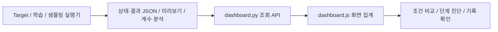
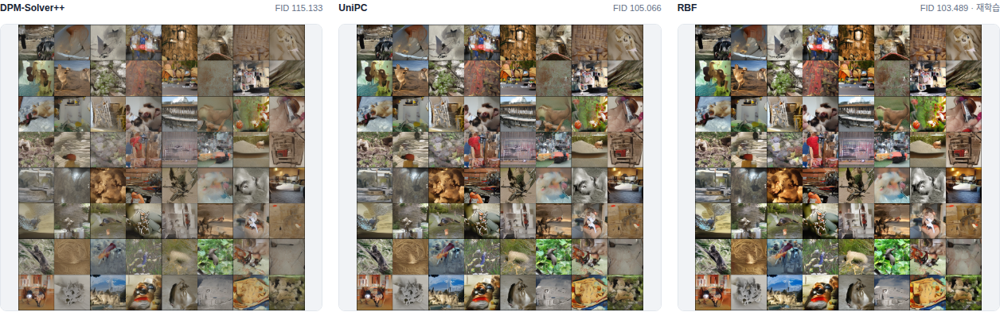
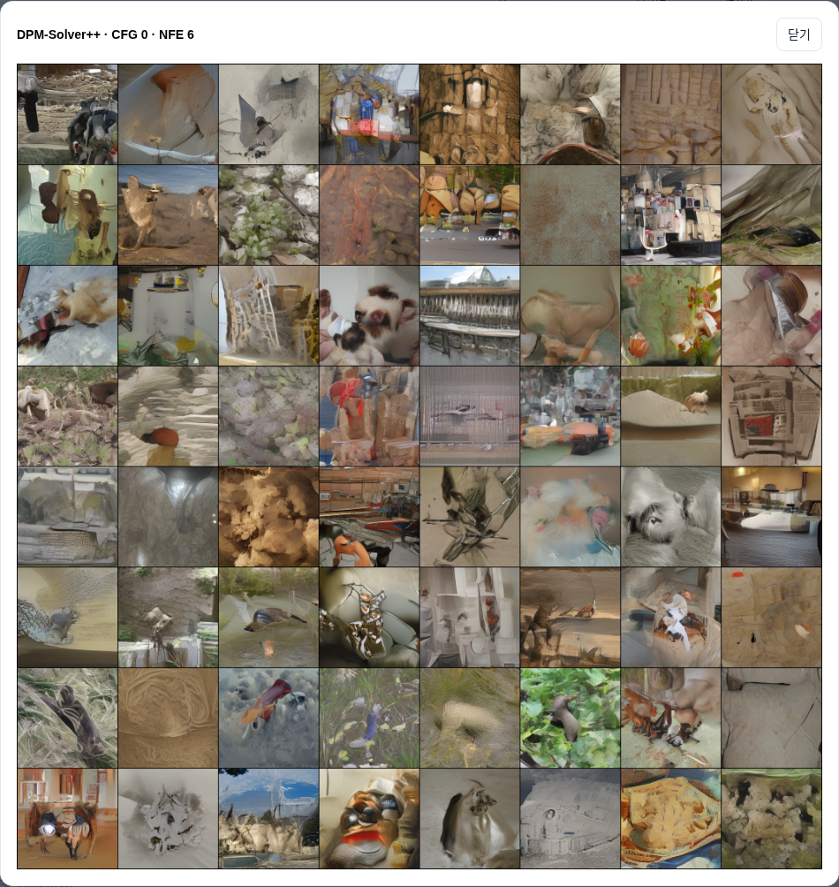
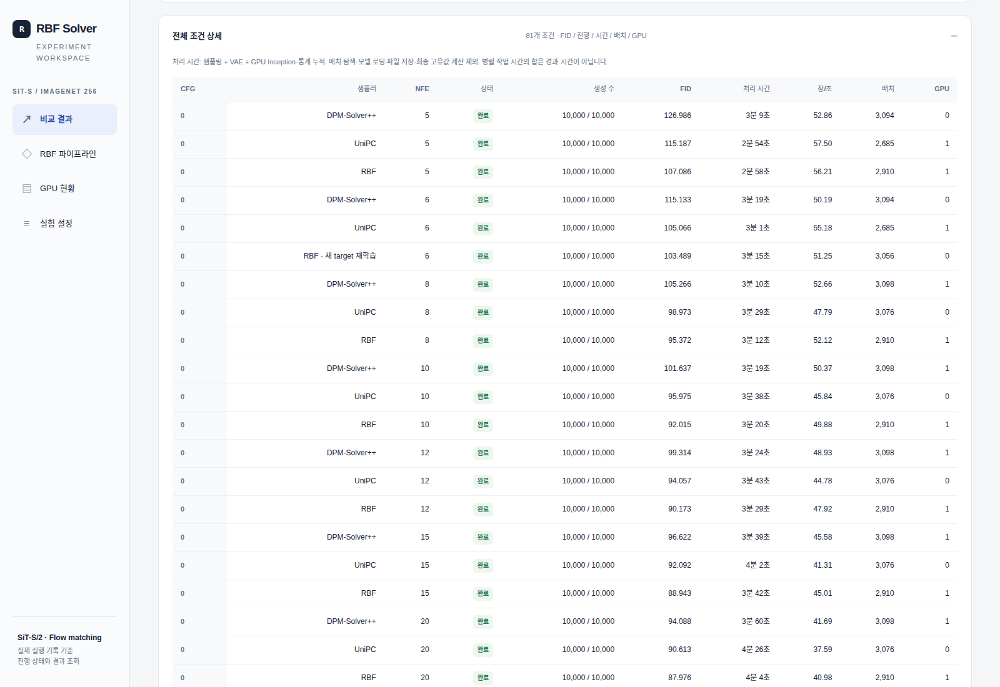
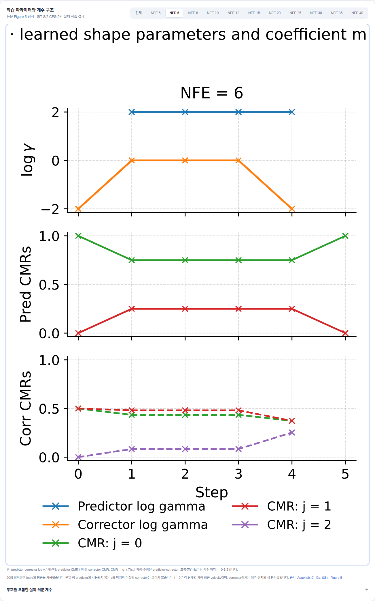
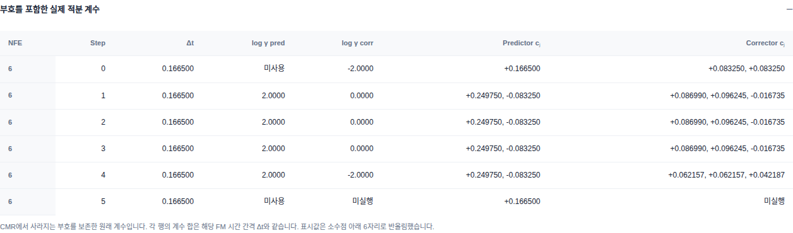
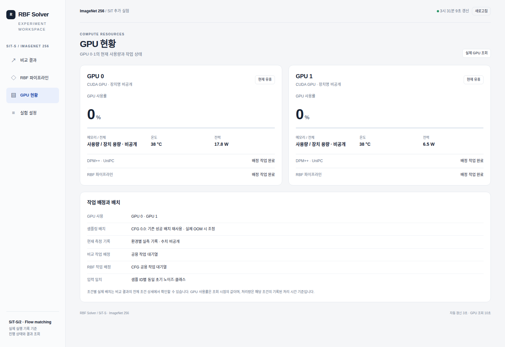
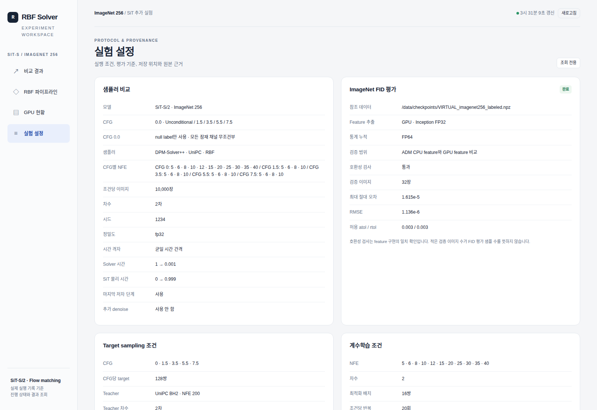
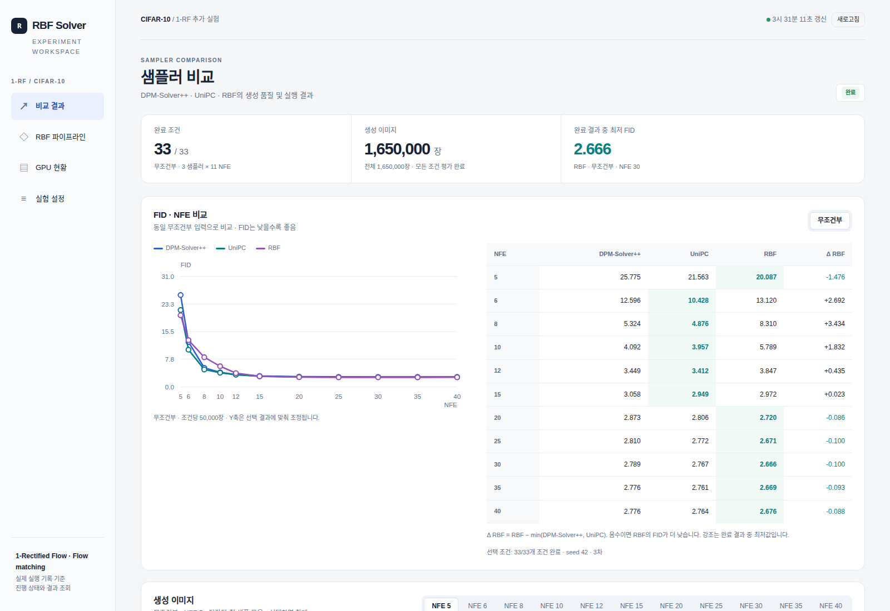
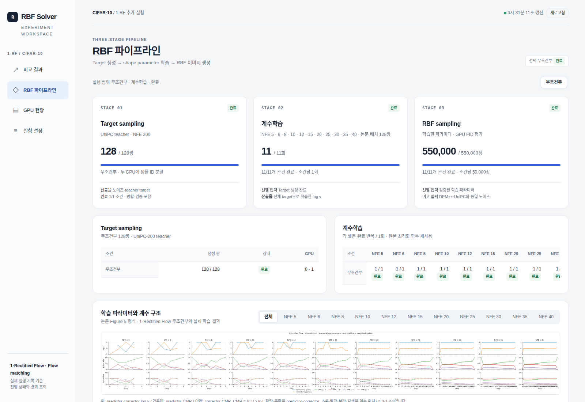

# 대시보드 사용 가이드 — 실험 상태·비교·RBF 학습 해석

이 대시보드는 **실험 실행기가 저장한 기록을 읽어, 진행 상태와 결과를 함께 확인하는 조회 화면**이다.
SiT-S/2의 ImageNet 256 실험을 중심으로 설명하고, 같은 구조를 사용하는 1-RF의 차이를 뒤에서 정리한다.
설치·가중치 이전·서버 실행·학습 명령은 [인수인계 문서](HANDOFF.md)를 따른다.

스크린샷은 2026-10-08 실제 완료 기록으로 운영 중인 두 대시보드에서 캡처했다.
진행 중·오류 상태를 연출하거나 결과 숫자를 바꾸지 않았다.
GPU 화면에서는 공개 문서에 불필요한 장치명·메모리 사양·용량 범위만 가렸다.
사용자 브라우저 화면과 실행 데이터는 변경하지 않았다.
[캡처 조건과 이미지 해시](docs/dashboard/screenshots.json)도 함께 제공한다.

## 목차

1. [역할과 화면 구조](#1-역할과-화면-구조)
2. [비교 결과 읽기](#2-비교-결과-읽기)
3. [생성 이미지와 확대 보기](#3-생성-이미지와-확대-보기)
4. [전체 조건 상세와 처리 시간](#4-전체-조건-상세와-처리-시간)
5. [RBF 파이프라인의 세 단계](#5-rbf-파이프라인의-세-단계)
6. [학습 파라미터와 적분 계수](#6-학습-파라미터와-적분-계수)
7. [GPU 현황](#7-gpu-현황)
8. [실험 설정과 평가 근거](#8-실험-설정과-평가-근거)
9. [상태·갱신·연결 오류](#9-상태갱신연결-오류)
10. [1-RF 화면의 공통점과 차이](#10-1-rf-화면의-공통점과-차이)
11. [실무 확인 순서와 구현 연결](#11-실무-확인-순서와-구현-연결)

## 1. 역할과 화면 구조

| 메뉴 | 답하는 질문 | 주요 정보 |
|---|---|---|
| **비교 결과** | 같은 조건에서 어느 샘플러의 결과가 좋은가? 현재 얼마나 끝났는가? | 완료 수, 생성 수, CFG별 FID·NFE 그래프와 표, 이미지, 조건별 기록 |
| **RBF 파이프라인** | target·계수학습·RBF 샘플링 중 어느 단계인가? 실제로 어떤 계수를 쓰는가? | 단계별 진행, NFE별 반복, log γ, CMR, 부호 있는 계수, RBF 결과 |
| **GPU 현황** | 자원이 사용 중인가? 어느 작업의 기록이 남아 있는가? | 사용률, 메모리, 온도, 전력, 작업자 상태, 배치 정책 |
| **실험 설정** | 이 결과가 어떤 모델·시간 구간·표본 수·평가 기준으로 만들어졌는가? | 수치 조건, FID 호환성 검사, 저장 위치, 체크포인트 식별, 근거 원문 |

서버의 기록과 화면은 다음 관계다.



**화면의 선택과 실행 제어는 별개다.** CFG·NFE 버튼은 표시 대상을 선택한다.
새로고침은 저장된 상태를 다시 조회한다.
학습 시작·중단·재개, GPU 배정 변경, 샘플 재생성, 설정 수정, 파일 삭제 버튼은 없다.
브라우저를 닫아도 서버의 계산 작업이 자동 중단되는 구조가 아니다.

처음 사용할 때는 **전체 완료 수 → 비교 CFG → 같은 NFE의 세 방법 → 이미지 → 필요하면 RBF 단계·계수** 순서로 읽으면 된다.

## 2. 비교 결과 읽기


*그림 1. SiT 비교 결과. 상단은 전체 실험 집계이며, 아래 그래프와 표는 선택한 CFG 0.0의 결과다.*

### 상단 세 지표

| 지표 | 이 화면의 의미 | 캡처 값의 해석 |
|---|---|---|
| 완료 조건 | 결과가 완료 상태인 조합 / 표시 대상 전체 조합 | **81/81**. 양수 CFG 4개×NFE 4개×방법 3개 + CFG 0×NFE 11개×방법 3개 |
| 생성 이미지 | 현재 채택된 조건별 진행량의 합 | **810,000장**. target 생성이나 이전에 대체된 반복 실행까지 합친 총 계산량이 아님 |
| 완료 결과 중 최저 FID | 전체 완료 조건에서 가장 낮은 FID | **13.549, RBF·CFG 3.5·NFE 10**. 현재 선택한 CFG 0.0의 최저값이 아님 |

상단 최저값은 전체 결과를 빠르게 찾는 지표다.
CFG와 NFE가 다른 조건을 섞은 값이므로, 샘플러의 우열을 판단할 때는 아래의 **같은 CFG·같은 NFE** 행을 비교한다.
상단 지표는 CFG 버튼을 바꿔도 선택 CFG만의 집계로 바뀌지 않는다.

### CFG·NFE·색상

- **CFG 버튼:** 선택 CFG의 FID 그래프·표·이미지를 함께 바꾼다.
- **NFE 버튼:** 아래 생성 이미지의 NFE를 바꾼다. FID 그래프를 한 점으로 줄이는 기능은 아니다.
- **비교 화면의 CFG와 RBF 화면의 CFG는 별도 선택이다.** 화면을 이동한 뒤 선택 표시를 확인한다.
- 비교 그래프의 파랑은 DPM-Solver++, 청록은 UniPC, 보라는 RBF다. 점 위에서는 방법·NFE·FID 정보를 확인할 수 있다.

NFE는 샘플링의 모델 평가 횟수이며 이미지 수나 RBF 학습 반복 수가 아니다.
CFG 0.0은 SiT의 null label을 직접 사용하는 무조건부 분기다.
조건부·무조건부를 함께 학습한 체크포인트의 분기를 평가한 것이며, 별도로 unconditional-only 학습한 모델을 뜻하지 않는다.

### FID 표와 Δ RBF

FID는 같은 데이터셋·표본 규모·평가 방식 안에서 비교하며 낮을수록 좋다.
표는 소수점 아래 세 자리로 표시하지만 원본 실행 기록에는 더 높은 정밀도의 수치가 남는다.

```text
Δ RBF = FID(RBF) − min(FID(DPM-Solver++), FID(UniPC))
```

| 표시 | 읽는 방법 |
|---|---|
| Δ RBF < 0 | RBF가 두 기준 방법 중 더 낮은 FID보다도 낮음 |
| Δ RBF > 0 | 적어도 한 기준 방법이 RBF보다 낮음 |
| Δ RBF = 0 부근 | 차이의 실제 원본 정밀도를 확인할 필요가 있음 |
| — / 대기·오류 등 상태 | 필요한 FID가 아직 없거나 해당 상태에 있음. FID 0을 의미하지 않음 |
| 강조된 FID 셀 | 해당 NFE 행에서 수치가 있는 방법 중 최저값. 모든 방법이 완료됐는지도 함께 확인 |

Δ는 세 방법의 FID가 모두 있을 때 계산한다. 퍼센트 개선율이 아니다.
강조와 Δ 계산은 표시용으로 반올림하기 전의 값에 기반하므로, 화면상 같은 숫자로 보여도 강조가 다를 수 있다.

그래프 Y축은 선택 결과에 맞춰 자동 조정된다.
따라서 CFG를 바꾼 전후의 선 높이나 기울기만으로 비교하지 말고, 축 범위와 표의 숫자를 함께 읽는다.
결과가 없는 NFE는 0으로 그리지 않으며 그 구간의 선도 연결하지 않는다.

### NFE 6의 “새 target 재학습”

캡처의 CFG 0.0·RBF·NFE 6은 사용자가 요청한 최신 재학습 결과다.
현재 값 아래에 이전 FID가 함께 표시되며, 기존 실행은 `previous` 기록으로 남는다.

| 항목 | 실제 값 |
|---|---:|
| 기존 FID | 103.48957989114041 |
| 새 target 재학습 FID | 103.48928057712658 |
| 차이 | −0.0002993140138300987 |

세 자리 표시에서는 이전 `103.490`과 현재 `103.489`로 보이지만 실제 차이가 0.001인 것은 아니다.
새 target으로 20회 최적화한 손실 기록은 달라졌으나 선택된 log γ는 원본과 동일했다.
이 미세 차이를 “계수 개선”으로 해석하지 않는다.
대시보드는 더 좋은 결과를 골라 표시한 것이 아니라 **최신 요청 실행을 표시**한다.
원본 미리보기는 `/rbf-preview/0/6?variant=original`로 조회할 수 있다. 화면에 별도의 원본 전환 버튼이 있는 것은 아니다.

## 3. 생성 이미지와 확대 보기



*그림 2. 왼쪽부터 DPM-Solver++, UniPC, RBF. 저장된 첫 샘플 모음이며 RBF에는 재학습 표시가 붙는다.*

1. 위에서 비교 CFG를 선택한다.
2. 생성 이미지 영역에서 NFE를 선택한다.
3. 같은 위치의 샘플을 세 방법 사이에서 비교한다.
4. 이미지를 누르면 아래와 같이 확대되고, **닫기**로 돌아온다.



*그림 3. DPM-Solver++·CFG 0.0·NFE 6의 확대 화면. 제목에 선택 조건이 표시된다.*

비교 실행은 샘플 ID별 같은 초기 노이즈를 사용한다.
SiT 양수 CFG에서는 같은 클래스 입력도 사용하고 CFG 0에서는 클래스 라벨을 무시한다.
이는 짝을 맞춘 비교를 돕지만 서로 다른 수치 솔버의 출력이 같아야 한다는 뜻은 아니다.

미리보기는 전체 평가 집합이 아니다. 현재 저장 그리드는 첫 64개 샘플을 보여준다.
FID는 SiT 조건당 10,000장 전체의 특징 통계로 계산한다.
이미지가 좋아 보인다는 관찰과 전체 분포의 FID 평가는 서로 보완해서 읽는다.
이미지가 없거나 로딩에 실패하면 해당 안내가 나타나며, 다른 조건의 이미지를 대신 보여주는 기능은 없다.

## 4. 전체 조건 상세와 처리 시간



*그림 4. 전체 81조건 표의 앞부분. 선택 CFG만이 아니라 전체 조건이 들어 있다.*

| 열 | 의미 |
|---|---|
| CFG / 샘플러 / NFE | 한 평가 조건의 식별자 |
| 상태 | 완료·실행·대기·중단·오류 등 기록 기반 상태 |
| 생성 수 | 처리된 이미지 수 / 해당 조건의 목표 이미지 수 |
| FID | 저장된 평가 결과. 미완료 수치는 0으로 대체하지 않음 |
| 처리 시간 | 아래 정의에 따른 누적 처리 시간 |
| 장/초 | 해당 조건의 처리 이미지 수 ÷ 기록된 처리 시간 |
| 배치 | 해당 실행에서 기록한 샘플링 배치 크기 |
| GPU | 실행 기록의 GPU 번호 |

처리 시간에는 **샘플링 + SiT VAE 디코딩 + GPU Inception 특징 추출·통계 누적**이 포함된다.
배치 탐색, 모델 로딩, 파일 저장, 마지막 FID 고유값 계산은 제외된다.
1-RF에서는 VAE 대신 픽셀 변환이 해당 구간에 포함된다.

따라서 이 값은 모델 forward만의 순수 추론 시간이 아니며, 전체 작업을 시작해서 끝낼 때까지의 시간도 아니다.
병렬 작업의 처리 시간을 더한 값은 전체 경과 시간과 다르다.
장치·배치·동시 작업 조건이 다르면 같은 NFE라도 처리량이 달라질 수 있다. 화면의 배치를 다른 장비의 권장값으로 복사하지 않는다.

**조건별 실행 기록 원문**을 펼치면 설정, 입력·가중치·계수 식별자, 결과 등 저장된 JSON을 볼 수 있다.
화면의 세 자리 FID보다 정밀한 값과 재학습 이전 기록을 확인할 때 사용한다.
표와 긴 기록은 스크롤해 읽는다. 현재 UI에 열 정렬·검색·CSV 내보내기 버튼은 없다.
배포된 수치 요약 파일은 별도로 [결과 CSV](handoff/results.csv)에서 제공한다.

## 5. RBF 파이프라인의 세 단계


*그림 5. 선택 CFG 0.0의 현재 채택 결과: target 128쌍, 학습 220회, RBF 평가 이미지 110,000장.*

| 단계 | 목적 | 선행 입력 | 산출물 | 진행 단위 |
|---|---|---|---|---|
| **01 Target sampling** | 고비용 teacher로 학습용 목표 쌍 생성 | 저장된 초기 noise와 조건 | teacher target 및 대응 입력 | **쌍** |
| **02 계수학습** | NFE별 RBF shape parameter 최적화 | 검증된 target 쌍 | 반복별 log γ, 집계 파라미터, 계수 자료 | **최적화 반복 회** |
| **03 RBF sampling** | 학습한 파라미터로 평가용 이미지 생성·FID 계산 | 검증된 계수와 비교용 입력 은행 | 이미지 미리보기, 통계, FID, 실행 기록 | **이미지 장** |

여기서 계수학습은 SiT 모델 가중치를 다시 학습하는 과정이 아니다.
모델 가중치를 고정한 상태에서 기존 `RBFSolver.sample_with_optim()`으로 샘플러의 shape parameter를 최적화한다.
Target 생성 중이라는 사실을 평가용 RBF 샘플링이 시작됐다는 뜻으로 읽으면 안 된다.

### 숫자를 읽는 방법

- **128/128쌍:** 현재 표시되는 target 입력 규모. SiT teacher는 UniPC-200이다.
- **220/220회:** CFG 0의 11 NFE × 조건당 20회. 220 epoch나 220장의 이미지라는 뜻이 아니다.
- **110,000/110,000장:** 11 NFE × RBF 조건당 10,000장. DPM++·UniPC 이미지는 이 카드에 포함하지 않는다.
- 아래 target 표는 CFG별 생성 수·상태·GPU 기록, 학습 표는 NFE별 완료 반복을 보여준다.
- NFE 열이 화면보다 길면 학습 표를 가로로 스크롤한다.

이 집계는 현재 비교에 채택된 결과 기준이다.
이전 NFE 6의 20회 학습·10,000장과 새 실행을 둘 다 더한 누적 비용이 아니다.
target 128쌍도 재학습을 포함한 모든 target 생성 총량을 뜻하지 않는다.
**NFE 6만 새 target으로 다시 학습했으며, 나머지 NFE까지 모두 같은 새 target으로 재학습했다는 뜻이 아니다.**

RBF 화면의 CFG 버튼은 세 단계·학습표·계수·RBF 결과를 해당 CFG로 바꾼다.
위쪽 실행 범위 문장은 선택 화면과 별도로 최근 실행 선택 기록을 보여줄 수 있으므로, **선택 CFG 표시**와 구분한다.
하단 RBF 샘플링 결과는 같은 CFG·NFE의 DPM++·UniPC FID를 함께 보여주고 RBF 미리보기를 제공한다.
**단계별 실행·저장 기록**을 펼치면 selection, targets, conditions, workers, sampling 원문을 확인할 수 있다.

## 6. 학습 파라미터와 적분 계수



*그림 6. 실제 NFE 6 계수 화면. 원본 그림의 긴 영문 제목 일부가 잘려 보이므로 선택 조건은 패널의 CFG·NFE 표시로 확인한다.*

이 그림은 [논문 Appendix E·Eq. (33)·Figure 5](https://arxiv.org/html/2603.13330v1)의 **표현 방식**을 따른다.
그 안의 수치는 이번 FM 실험에서 학습·복원한 값이며 논문의 원래 실험 수치를 가져온 것이 아니다.

| 위치 | 값과 색상 | 의미 |
|---|---|---|
| 위 | 파랑 predictor, 주황 corrector의 **log γ** | 단계별 학습된 shape parameter. γ 자체가 아니며 γ = exp(log γ) |
| 가운데 | Predictor CMR | predictor 적분 계수들의 상대적인 크기 |
| 아래 | Corrector CMR | corrector 적분 계수들의 상대적인 크기 |
| 가로축 | Step | 해당 NFE 샘플링의 단계 인덱스, 0부터 시작 |
| 초록·빨강·보라 | 계수 위치 j=0·1·2 | 방법 이름이 아닌 velocity 항의 위치. 1-RF에는 갈색 j=3도 있음 |

`j=0`은 가장 최근 velocity 항이다. Corrector에서는 예측 위치에서 새로 평가한 값을 가리킨다.
비교 화면의 보라색 RBF와 계수 그림의 보라색 j=2는 다른 범례다.

```math
\mathrm{CMR}_j=\frac{|c_j|}{\sum_k |c_k|}
```

CMR은 부호를 제거하고 합을 1로 정규화한 비율이다.
확률·FID 기여율·계수 자체로 해석하지 않는다.
예를 들어 predictor 계수가 `(+0.249750, −0.083250)`이면 CMR은 `(0.75, 0.25)`지만 두 번째 계수는 실제로 음수다.

- **전체 / NFE 버튼**은 계수 그림과 아래 실제 계수 표를 선택한다. 세 단계 전체 집계까지 단일 NFE로 바꾸지는 않는다.
- 그래프를 누르면 확대된다. 여러 NFE를 한 화면에 넣은 전체 그림이 작을 때 개별 NFE를 선택한다.
- SiT는 20회 최적 log γ의 **평균**을 사용한다. γ의 산술평균으로 설명하면 안 된다.
- 단일 항 predictor의 사용되지 않는 γ와 마지막 미실행 corrector는 유효한 값처럼 그리지 않는다. 빈 구간은 자동으로 실패를 뜻하지 않는다.

### 부호를 포함한 실제 적분 계수



*그림 7. 같은 CFG 0.0·NFE 6의 실제 계수. Δt=0.166500이며 마지막 corrector는 미실행이다.*

이 표는 NFE·Step·Δt·predictor/corrector log γ·부호 있는 계수 벡터를 제공한다.
`미사용`과 `미실행`은 수치 0이 아니다.
유효한 각 계수 벡터의 합은 해당 FM 시간 간격 Δt와 일치하는지 분석 생성 단계에서 검사한다.
화면은 계수 여섯 자리, log γ 네 자리로 반올림하므로 정확한 합 검증은 원본 수치를 사용한다.

계수 분석 파일을 만들 때는 shape 파일 해시, 반복별 파일, log γ 집계, CMR 합, 실제 준비된 solver 계수를 확인한다.
브라우저는 이 검증 결과와 저장된 그림을 읽는다. 새로고침할 때마다 계수를 다시 학습하거나 모든 해시를 재검증하지 않는다.

## 7. GPU 현황



*그림 8. 완료 이후의 실제 유휴 상태. 공개용으로 장치명·메모리 사양·용량 범위를 가렸다.*

| 표시 | 용도 | 해석 시 주의 |
|---|---|---|
| GPU 사용률 | 조회 시점의 활동 확인 | 0% 한 번만으로 전체 작업 완료를 판단하지 않음 |
| 사용 메모리 / 전체 | 실제 메모리 점유와 장치 용량 확인 | 샘플링 배치나 모델 가중치 크기와 같은 단위가 아님 |
| 온도 / 전력 | 실행 환경의 관측값 | 알고리즘 품질 지표가 아님 |
| DPM++·UniPC / RBF 작업자 | 최근 작업·단계·반복·오류 기록 확인 | “배정 작업 완료”는 해당 작업자의 기록이며 전체 조건 완료 수와 함께 확인 |
| 작업 배정과 배치 | 계획의 GPU 목록·배치 정책·측정 기록·입력 일치 확인 | 이 화면에서 배정이나 배치를 바꾸는 기능은 없음 |

GPU 값은 서버가 `nvidia-smi`로 조회하고 최대 10초간 캐시한다.
브라우저가 3초마다 갱신돼도 GPU 값이 매번 달라지지는 않을 수 있다.
조회에 실패하면 실패 안내를 보여주며 사용량을 임의로 0이라고 채우지 않는다.
장치 전체의 관측값이므로 다른 프로세스의 사용량도 포함될 수 있다. 이 실험만의 사용량으로 단정하지 않는다.

현재 코드의 배치 정책은 [환경별 용량 검증과 NFE 간 재사용](HANDOFF.md#6-배치-용량과-실행-경계)을 따른다.
과거 실행에서 기록한 배치와 새 환경에서 검증된 배치를 구분한다.
대시보드에 `배치 탐색` 상태명이 있다고 해서 매 NFE마다 자동 탐색한다는 뜻은 아니다.
하드웨어와 계획이 달라진 경우의 명시적 검증 절차는 실행 문서에서 다룬다.

## 8. 실험 설정과 평가 근거



*그림 9. 비교 조건과 FID 검증을 함께 확인하는 화면. 아래로 스크롤하면 target·계수학습 조건과 접힌 기록이 이어진다.*

| 영역 | 확인할 내용 |
|---|---|
| 샘플러 비교 | 모델, CFG, CFG별 NFE 범위, 표본 수, 차수, 시드, 정밀도, 시간 격자·구간, 마지막 저차, 추가 denoise |
| FID 평가 | 참조 파일, 특징 추출·통계 정밀도, 구현 호환성 검사 결과·오차·허용값 |
| Target 조건 | CFG별 target 수, teacher 방법·NFE·차수·시간 조건 |
| 계수학습 조건 | NFE, history 차수, 최적화 배치, 반복 수, 복원추출, 집계, log γ 후보, 고정 모델 가중치 |
| 저장 위치와 모델 식별 | 출력 위치, checkpoint·VAE, 가중치 SHA-256, 기준 코드, 준비 검증 기록 |
| 조건의 근거와 원본 기록 | 원문·코드·사용자 지정 조건 등 저장된 출처 설명 |
| 전체 설정 원문 | 비교·RBF·FID 검사 설정 JSON |

**FID 호환성 검사의 32장과 FID 평가의 10,000장은 다르다.**
그림의 32장은 두 특징 추출 구현을 대조한 검증 표본이다.
실제 SiT 비교 결과는 각 조건 10,000장으로 평가했다.
`호환성 검사 통과`도 모델 생성 품질이나 다른 환경에서의 완전한 수치 재현까지 보장하는 표시는 아니다.

설정은 조회 전용이다. 과거 출처 설명과 준비 당시 문구도 보존되므로 실제 완료 여부는 현재 결과·진행 기록으로 확인한다.
통합 설정에는 CFG별로 다른 NFE의 합집합이 나타날 수 있다. 모든 CFG가 모든 NFE를 실행했다는 뜻은 아니며 **CFG별 NFE** 줄을 확인한다.
브라우저를 통한 설정 변경·가중치 교체·학습 재시작 기능은 없다.

## 9. 상태·갱신·연결 오류

캡처한 실험은 모두 완료됐다. 아래 실행·오류 상태는 실제 구현에서 제공하는 의미를 설명한 것이며,
이번 스크린샷을 진행 중이거나 장애가 발생한 시점의 화면이라고 제시하지 않는다.

| 표시 상태 | 의미 |
|---|---|
| 실행 전 / 대기 | 아직 실행 결과가 없거나 해당 작업이 시작되지 않음 |
| 설정 대기 | 계획이 실행 가능 상태로 확정되지 않음 |
| 시작 중 / 모델 로딩 | 작업 진입 또는 모델·평가 자산 로딩 |
| 배치 탐색 | 용량 검증 관련 작업 기록 |
| Target 생성 중 / 병합 중 | teacher target 처리 또는 분할 결과 병합 |
| 학습 중 / 평균 계산 중 | shape 최적화 또는 반복 결과 집계 |
| 실행 중 | 평가용 샘플링 처리 기록 |
| FID 평가 중 | 평가 단계 기록 |
| 중단됨 | 실행 상태 기록은 있으나 대응 작업자가 확인되지 않는 경우 등 |
| 오류 | 오류 기록이 존재함. 상세 메시지 확인 필요 |
| 완료 | 해당 단계/조건의 완료 산출물과 상태가 반영됨 |

파일이 없거나 읽을 수 없으면 상세 기록이 충분하지 않을 수 있다.
상태 표시는 작업자·기록을 종합한 운영 정보이며 독립적인 결과 무결성 인증서가 아니다.
결과와 오류 파일이 동시에 남아 있으면 FID 숫자와 오류 표시가 함께 나타날 수 있으므로 **숫자만 보지 말고 상태도 확인**한다.

### 자동·수동 갱신

- 비교·RBF·계수 API는 기본 3초 주기로 조회한다. 이전 조회가 진행 중이면 중복 조회를 시작하지 않는다.
- 개별 요청의 제한 시간은 9초다. 네트워크가 느리면 실제 갱신 간격은 3초보다 길어진다.
- **새로고침**은 수동 조회이며, 요청 중에는 버튼이 비활성화된다.
- 현재 페이지 안에서는 선택 CFG·NFE, 주요 펼침 상태와 화면별 스크롤 위치를 유지하도록 처리한다.
- 페이지 자체를 새로 로드한 뒤까지 선택을 영구 저장하는 기능은 아니다.

일부 API가 실패하면 상단에 **일부 상태 갱신 실패**와 실패 영역을 표시한다.
이전에 받은 자료가 있으면 마지막 확인 시각과 함께 유지한다.
자료가 없으면 확인된 기록이 없다고 알린다.
따라서 화면에 결과가 남아 있다는 사실만으로 최신 연결이 정상이라고 판단하지 않는다.

예상 잔여 시간은 남은 이미지 수와 실행 중 작업의 기록된 처리율에서 추정한다.
작업 방식 변화·다음 단계 비용을 모두 예측하는 일정 보장이 아니며,
활성 처리율이 없으면 임의의 완료 시간을 제시하지 않는다.

## 10. 1-RF 화면의 공통점과 차이



*그림 10. 1-RF는 11 NFE×3방법=33조건, 조건당 50,000장이다. NFE별로 최저 방법이 달라지는 실제 결과를 보여준다.*

같은 네 메뉴·비교 방식·이미지 확대·기록 확인 구조를 사용한다.
다만 모델·데이터셋·평가 규모·차수·teacher 설정은 SiT와 다르다.

| 항목 | SiT 대시보드 | 1-RF 대시보드 |
|---|---|---|
| 모델 / 데이터 | SiT-S/2 / ImageNet 256 | 비증류 1-Rectified Flow / CIFAR-10 |
| 조건 선택 | CFG 0·1.5·3.5·5.5·7.5 | 무조건부 |
| 평가 규모 | 조건당 10,000장 | 조건당 50,000장 |
| 차수 / UniPC | 2차 / BH2 | 3차 / BH1 |
| **실제 시드** | **1234** | **42** |
| NFE | CFG 0은 11개, 양수 CFG는 4개 | 11개 |
| RBF 학습 | 128 target에서 16쌍씩 20회, log γ 평균 | 128 target 전체로 1회 |
| 시간 격자 | SiT 물리 시간의 균일 간격 | 프로젝트 CIFAR-10 VP log-SNR 격자를 RF에 연결 |
| 전체 완료 집계 | 81조건 / 810,000장 | 33조건 / 1,650,000장 |

1-RF 내부 설정의 CFG 1은 무조건부 실행 식별값이며 SiT guidance scale과 같은 의미가 아니다.
두 모델의 FID 숫자를 데이터셋 차이를 무시하고 직접 비교하지 않는다.
시드는 설명용 가정이 아니라 각 JSON 설정과 저장된 모든 결과의 `config.seed`에서 확인한 값이다.



*그림 11. 1-RF: target 128쌍, 11 NFE×1회 학습=11회, RBF 평가 11×50,000=550,000장.*

여기서 **11/11회**를 SiT의 220/220회와 같은 최적화 규모로 해석하면 안 된다.
1-RF는 한 번에 128쌍을 사용하며, 계수 그림도 SiT의 20회 평균이 아닌 해당 최적화 결과다.

## 11. 실무 확인 순서와 구현 연결

### 자주 하는 확인

| 확인하려는 일 | 화면에서의 순서 |
|---|---|
| 같은 계산 횟수에서 품질 비교 | 비교 결과 → CFG → 같은 NFE 행의 FID와 Δ → 해당 NFE 이미지 |
| RBF가 아직 나오지 않는 이유 확인 | RBF CFG 선택 → target → 학습 반복 → sampling 상태 → 오류·원문 |
| 학습한 파라미터의 역할 확인 | RBF CFG → 계수 NFE → log γ·CMR → 부호 있는 계수 표 |
| 계산이 계속되는지 확인 | 현재 실행 패널·단계 상태 → 마지막 갱신 시각 → GPU 현황·작업자 기록 |
| 재실험 전후 확인 | 최신 결과의 재학습 표시 → 이전 FID → 실행 기록의 previous·target/shape 식별자 |
| 다른 환경에 인수인계 | 설정·출처 확인 → [HANDOFF](HANDOFF.md) → 외부 자산 이전·해시 검사 |

### 화면과 근거 코드

| 기능 | 구현 |
|---|---|
| 화면 구조와 메뉴 | [dashboard.html](dashboard.html) |
| 선택·표·그래프·확대·갱신·오류 표시 | [dashboard.js](dashboard.js) |
| 결과 집계·상태·GPU·미리보기 API | [dashboard.py](dashboard.py) |
| 샘플링·시간·진행·FID 기록 생성 | [benchmark.py](benchmark.py) |
| RBF target·학습 단계 기록 | [rbf_training_run.py](rbf_training_run.py), [rbf_pipeline.py](rbf_pipeline.py), [rbf_followup.py](rbf_followup.py) |
| 실제 계수 분석·CMR·그림 | [plot_rbf_coefficients.py](plot_rbf_coefficients.py) |
| GPU FID 계산 | [fid_gpu.py](fid_gpu.py) |
| 1-RF의 대응 구현 | [1rf 디렉터리](../1rf/) |

주요 조회 경로는 `/api/comparison`, `/api/rbf-training`, `/api/rbf-coefficients?cfg=<값>`이다.
`/api/status`는 기반 비교 계획의 상태이며, RBF와 추가 실험을 합친 전체 비교는 `/api/comparison`을 사용한다.
미리보기와 계수 그림도 저장된 파일을 읽는 GET 경로다.

### 캡처 범위와 재현

기준 코드: `b1a22204c5cb4a756dc3aa3e2daa5870ace72ad8`.
데스크톱 viewport는 1600×1100이며 일부 그림은 해당 패널만 캡처했다.
11개 이미지 모두 실제 API 자료로 렌더링한 화면이며 브라우저 JavaScript 오류가 없음을 확인했다.
완료 상태, 필터, 이미지 확대, 펼침, 계수 선택을 확인했으며 이번 문서 작성을 위해 학습이나 샘플링을 다시 시작하지 않았다.
모바일·진행 중·네트워크 장애 상태를 모두 새로 실증했다는 주장은 하지 않는다.

[캡처 스크립트](docs/dashboard/capture.py)는 별도의 headless 브라우저에서 동작한다.
[재캡처 방법](docs/dashboard/README.md)에는 선택 조건·저장 위치·공개용 가림 범위를 명시했다.
MD와 그림을 확인하는 데 Playwright 설치는 필요하지 않다.
