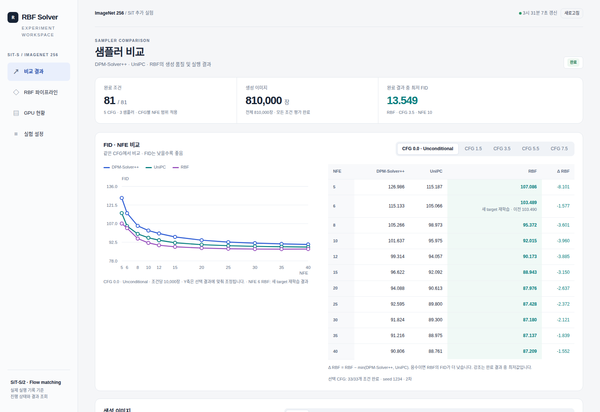
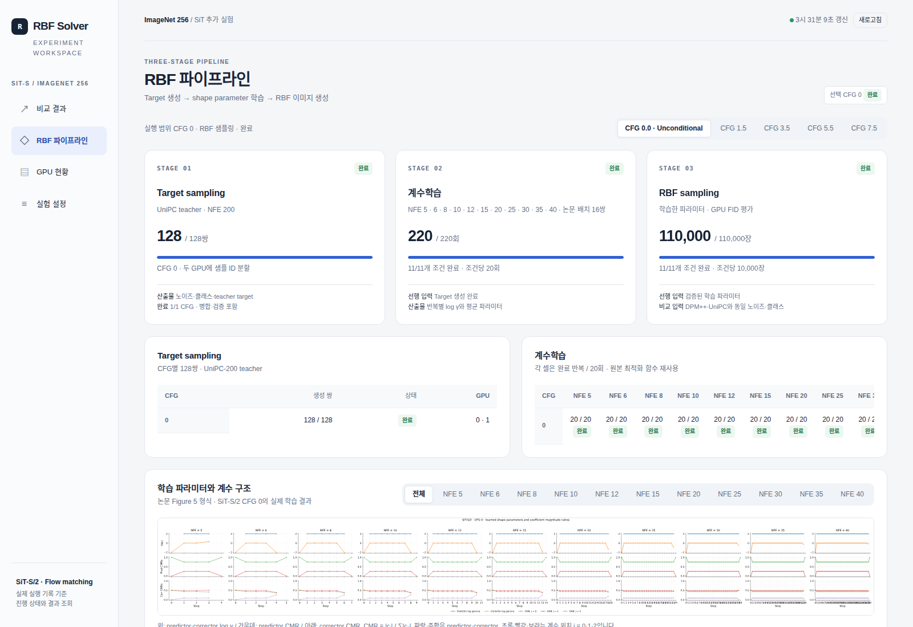

# SiT-S/2 · ImageNet 256

**RBF-Solver · DPM-Solver++ · UniPC Flow-matching sampling, shape optimization & GPU FID**

 

[프로젝트](../README.md) · [대시보드 가이드](DASHBOARD_GUIDE.md) · [설치·재현](HANDOFF.md) · [전체 결과](handoff/results.csv) · [구현 상세](IMPLEMENTATION_NOTES.md)

SiT-S/2의 ImageNet 256×256 생성에서 **RBF-Solver, DPM-Solver++, UniPC**를 비교하는 추가 실험이다.
모델 가중치는 고정하고, 같은 평가 입력과 조건에서 샘플러를 비교한다. RBF의 target 생성·shape parameter 최적화·평가용 샘플링을 구분하고 대시보드에서 함께 확인한다.

[RBF-Solver 논문](https://arxiv.org/abs/2603.13330)과 저장소의 ImageNet 256 구현을 출발점으로 삼았다.
이 디렉터리의 결과는 SiT에 적용한 추가 실험이며, 원 논문의 Guided Diffusion 결과와 구분한다.

  
   
  실제 완료 기록의 비교 화면. 상단은 전체 집계, 그래프와 표는 선택 CFG의 결과다. 이미지를 누르면 상세 가이드로 이동한다.

## 실험 범위

**2026-10-08 공개 기록: 81조건 완료 · 조건당 10,000장 · 현재 채택 결과 810,000장.**

| 구분 | CFG | NFE | 비교 방법 | 완료 조건 |
|---|---|---|---|---:|
| 조건부 비교 | 1.5 · 3.5 · 5.5 · 7.5 | 5 · 6 · 8 · 10 | DPM-Solver++ · UniPC · RBF | 48 |
| Null-label 비교 | 0.0 | 5 · 6 · 8 · 10 · 12 · 15 · 20 · 25 · 30 · 35 · 40 | 동일 | 33 |

한 조건은 **CFG × 샘플러 × NFE** 조합이다. 모든 CFG에서 11개 NFE를 평가한 것은 아니다.
810,000장은 현재 비교에 채택된 평가 집합이며, target 생성이나 교체 전 재학습 결과까지 합한 누적 계산량이 아니다.

**CFG 0.0의 의미:** 조건부 체크포인트의 null-label 분기를 직접 평가한다.
별도로 unconditional-only 학습한 모델이라는 뜻은 아니다. Label 1000을 넣고 latent 네 채널 모두 무조건부 출력을 사용하며, 양수 CFG의 기존 guidance 경로와 구분한다.

### 수치 조건

| 항목 | SiT 실험 설정 |
|---|---|
| 모델 / 해상도 | SiT-S/2 / ImageNet 256×256 |
| 샘플러 | RBF-Solver · DPM-Solver++ · UniPC BH2 |
| 차수 / 실행 방식 | 2차 / multistep / 마지막 저차 단계 / 추가 denoise 없음 |
| 시간 격자 | 균일 시간 간격; SiT 시간 `s: 0 → 0.999`, solver 시간 `t: 1 → 0.001` |
| 평가 표본 / 시드 | 조건당 10,000장 / 1234 |
| 비교 입력 | 샘플 ID별 같은 초기 노이즈; 양수 CFG에서 같은 클래스 라벨 |
| 정밀도 | 모델·Inception 특징 FP32, TF32 끔; 특징 통계·FID CUDA FP64 |
| RBF target | CFG별 128쌍 / UniPC-200 teacher |
| RBF 최적화 | 16쌍씩 복원추출 × 20회 / 최적 log γ의 평균 |
| 학습 대상 | 샘플러의 shape parameter; SiT 모델 가중치는 고정 |

설정·원전·변환 근거는 [인수인계 문서의 수치 조건](HANDOFF.md#8-수치-조건과-코드-대응)에 연결돼 있다.
다른 GPU와 배치에서도 입력 대응은 유지하지만 부동소수점 결과의 비트 단위 동일성을 보장하지 않는다.

## FID 결과

**[전체 CSV](handoff/results.csv) · [전체 JSON](handoff/results.json) · [비교 화면 읽는 방법](DASHBOARD_GUIDE.md#2-비교-결과-읽기)**

아래는 공개 결과 파일의 `experiment=sit` 전체 행이다. FID는 낮을수록 좋으며, **같은 CFG·같은 NFE**에서 비교한다.
숫자는 세 자리로 표시하고 각 행의 최저값을 굵게 표시했다. 원본 파일은 더 높은 정밀도를 보존한다.
Δ RBF는 `FID(RBF) − min(FID(DPM-Solver++), FID(UniPC))`이며 퍼센트가 아니다.

<strong>조건부 CFG 1.5 · 3.5 · 5.5 · 7.5 — 48조건 전체 보기</strong>

| CFG | NFE | DPM-Solver++ | UniPC | RBF | Δ RBF |
|---:|---:|---:|---:|---:|---:|
| 1.5 | 5 | 50.197 | 40.221 | **36.918** | -3.303 |
| 1.5 | 6 | 40.322 | 34.828 | **34.121** | -0.707 |
| 1.5 | 8 | 34.837 | 32.568 | **31.527** | -1.041 |
| 1.5 | 10 | 33.537 | 31.948 | **30.633** | -1.315 |
| 3.5 | 5 | 18.589 | 16.300 | **15.551** | -0.748 |
| 3.5 | 6 | 15.903 | 14.972 | **14.487** | -0.486 |
| 3.5 | 8 | 14.421 | 14.075 | **13.815** | -0.261 |
| 3.5 | 10 | 13.829 | 13.593 | **13.549** | -0.044 |
| 5.5 | 5 | 19.644 | 18.210 | **17.289** | -0.921 |
| 5.5 | 6 | 18.118 | 17.492 | **16.406** | -1.086 |
| 5.5 | 8 | 17.282 | 17.015 | **16.567** | -0.448 |
| 5.5 | 10 | 17.001 | 16.825 | **16.601** | -0.224 |
| 7.5 | 5 | 24.428 | 22.017 | **21.005** | -1.012 |
| 7.5 | 6 | 21.642 | 19.986 | **19.137** | -0.849 |
| 7.5 | 8 | 19.866 | 19.211 | **18.684** | -0.527 |
| 7.5 | 10 | 19.526 | 19.151 | **18.833** | -0.318 |

<strong>CFG 0.0 · null-label — 33조건 전체 보기</strong>

| CFG | NFE | DPM-Solver++ | UniPC | RBF | Δ RBF |
|---:|---:|---:|---:|---:|---:|
| 0.0 | 5 | 126.986 | 115.187 | **107.086** | -8.101 |
| 0.0 | 6 | 115.133 | 105.066 | **103.489** | -1.577 |
| 0.0 | 8 | 105.266 | 98.973 | **95.372** | -3.601 |
| 0.0 | 10 | 101.637 | 95.975 | **92.015** | -3.960 |
| 0.0 | 12 | 99.314 | 94.057 | **90.173** | -3.885 |
| 0.0 | 15 | 96.622 | 92.092 | **88.943** | -3.150 |
| 0.0 | 20 | 94.088 | 90.613 | **87.976** | -2.637 |
| 0.0 | 25 | 92.595 | 89.800 | **87.428** | -2.372 |
| 0.0 | 30 | 91.824 | 89.300 | **87.180** | -2.121 |
| 0.0 | 35 | 91.216 | 88.975 | **87.137** | -1.839 |
| 0.0 | 40 | 90.806 | 88.761 | **87.209** | -1.552 |

### NFE 6 재학습 기록

CFG 0.0·RBF·NFE 6은 **새 초기 노이즈에서 target 128쌍을 생성해 다시 최적화한 최신 요청 실행**을 표시한다.
기존 결과·target·계수도 보존했다. 같은 조건의 반복이므로 81조건에 별도 조건을 더하지 않는다.

기존 FID는 `103.48957989114041`, 새 실행은 `103.48928057712658`이다.
선택된 log γ는 기존과 동일하므로 이 미세한 FID 차이를 계수 개선으로 설명하지 않는다.
[재학습 입력·보존 방식](IMPLEMENTATION_NOTES.md#cfg-00-rbf-nfe-6-new-target-retraining)과 [대시보드의 이전 결과 표시](DASHBOARD_GUIDE.md#nfe-6의-새-target-재학습)를 확인할 수 있다.

## Target 생성부터 RBF 평가까지

| 단계 | 하는 일 | 입력 → 산출물 | 완료 단위 |
|---|---|---|---|
| **01 · Target sampling** | UniPC-200으로 학습용 목표 생성 | 초기 noise·조건 → 대응 target 쌍 | CFG별 128쌍 |
| **02 · Shape optimization** | 기존 `RBFSolver.sample_with_optim()`을 FM 연결부에서 재사용 | 검증된 target → 반복별 log γ·평균·계수 분석 | CFG·NFE별 20회 |
| **03 · RBF sampling & FID** | 학습한 파라미터로 평가 이미지 생성 | 검증된 파라미터·공통 평가 입력 → 미리보기·통계·FID | 조건당 10,000장 |

후속 실행은 낮은 NFE부터 해당 NFE의 학습과 세 샘플러 비교를 마친 뒤 다음 NFE로 진행한다.
기존 target·계수가 유효하면 재사용하고, CFG 0 확장에서도 기존 128쌍을 가져온다.
NFE 6의 별도 재학습만 새 target을 사용하며 다른 NFE의 target까지 교체하지 않는다.

  
   
  CFG 0.0의 현재 채택 기록: target 128쌍 · 11 NFE × 20회 최적화 · RBF 평가 110,000장. 재실험을 모두 더한 누적 비용과 구분한다.

### GPU 평가와 재개

- **GPU FID:** VAE 디코딩 이후 Inception 특징을 CUDA FP32로 추출하고, 평균·공분산 누적과 FID를 CUDA FP64로 계산한다. ADM 참조 통계 및 특징 구현 호환성 검증을 사용한다.
- **배치 재사용:** 동일한 GPU·모델·정밀도·차수·평가 조건에서 확인한 배치를 NFE 간 재사용한다. 새 환경의 용량 확인과 실제 OOM 복구를 구분하며, 매 NFE마다 탐색을 반복하지 않는다.
- **저장과 재개:** 미리보기·통계·배치별 진행 상태·입력과 설정 식별자를 보존한다. 재개는 대응하는 코드·계획·입력·모델·평가 자산을 확인한 뒤 수행한다.
- **이미지 보관 범위:** FID는 전체 10,000장으로 계산한다. 미리보기는 첫 64장이고, 모든 생성 이미지를 파일로 남기는 구조는 아니다.
- **시간 해석:** 기록된 처리 시간에는 샘플링·VAE·특징 통계 누적이 포함된다. 순수 모델 추론 시간이나 준비·저장을 포함한 전체 경과 시간과 다르다.

## 대시보드

| 화면 | 확인할 내용 |
|---|---|
| **비교 결과** | CFG·NFE 선택, 세 방법의 FID 그래프·표·Δ, 이미지 확대, 전체 조건 상세 |
| **RBF 파이프라인** | target·최적화·평가 상태, 학습된 log γ, CMR, 부호 있는 적분 계수 |
| **GPU 현황** | 장치 사용률·메모리·온도·전력, 작업자 기록, 배치 정책 |
| **실험 설정** | 수치 조건, FID 호환성 검사, 가중치·입력·코드의 출처와 식별자 |

**[실제 스크린샷 11장으로 보는 대시보드 가이드 →](DASHBOARD_GUIDE.md)**

대시보드는 저장 기록을 조회한다. 화면의 CFG·NFE 선택이나 새로고침은 샘플링 실행 명령이 아니다.
계수의 CMR은 절댓값을 정규화한 비율이므로 부호 있는 실제 계수와 함께 읽는다.
호환성 검사의 32장, 미리보기 64장, FID 평가 10,000장도 서로 다른 용도다.

## 설치·복원·실행

**처음 실행하거나 다른 장비로 옮긴다면 [설치·자산 복원·검증 가이드](HANDOFF.md)를 먼저 따른다.**

| 목적 | 진행 방법 |
|---|---|
| 완료 결과 열람 | 외부 결과·계수·미리보기를 복원하고 해시 검사 후 대시보드 시작 |
| 중단 실행 재개 | 그 실행의 manifest와 일치하는 코드·설정·자산 확인 후 해당 단계 재개 |
| 새 실험 | 새 결과 namespace와 환경별 GPU·용량 설정을 준비하고 단계별 진입점 사용 |
| 세부 구현 검토 | [시간 변환·끝점·CFG·평가·원본 호출 경로](IMPLEMENTATION_NOTES.md) 확인 |

[Dockerfile](handoff/Dockerfile), [Compose 설정](handoff/compose.yaml), [의존성 잠금 파일](handoff/requirements.lock),
[외부 자산 목록과 SHA-256](handoff/assets.json)을 제공한다.
호스트의 코드·데이터·참조 경로와 사용할 GPU는 대상 환경에 맞게 지정한다.
코드만 복제해도 기존 가중치·target·학습 파라미터·결과가 함께 복원되는 것은 아니다.

Target 생성, 최적화, RBF 샘플링, 조건부 비교, CFG 0 최초 실행·확장·재학습의 명령은
[단계별 진입점 표](HANDOFF.md#7-단계별-진입점과-의존성)에 모았다.
대시보드만 시작하는 것과 GPU 계산을 시작하는 것을 구분한다.

가중치·캐시·샘플링 결과는 코드 디렉터리 밖의 데이터 저장소에 둔다.
재현 환경의 내부 경로와 호스트 경로 대응은 인수인계 문서에서 관리한다.

## 구현과 출처

| 파일 / 문서 | 역할 |
|---|---|
| [`sampling.py`](sampling.py) | SiT 모델·시간 연결, DPM-Solver++·UniPC 호출, 시작점 극한 처리 |
| [`rbf_solver_fm.py`](rbf_solver_fm.py) | FM용 RBF 적분 및 상태 갱신 |
| [`rbf_shape_training.py`](rbf_shape_training.py) · [`rbf_training_run.py`](rbf_training_run.py) | 기존 최적화 루프와 FM target·손실·저장 연결 |
| [`rbf_pipeline.py`](rbf_pipeline.py) · [`rbf_followup.py`](rbf_followup.py) | 단계 실행, 선행 산출물 재사용, 후속 NFE 비교 |
| [`benchmark.py`](benchmark.py) · [`fid_gpu.py`](fid_gpu.py) | 평가 샘플 생성, 진행 저장, GPU FID |
| [`plot_rbf_coefficients.py`](plot_rbf_coefficients.py) | 학습 파라미터·CMR·부호 있는 계수 분석 |
| [`IMPLEMENTATION_NOTES.md`](IMPLEMENTATION_NOTES.md) | 기존 README의 기술 설명과 준비·확장·재학습 기록 보존 |
| [`HANDOFF.md`](HANDOFF.md) | 현재 설치·자산·실행·재현 기준 |
| [`DASHBOARD_GUIDE.md`](DASHBOARD_GUIDE.md) | 화면의 역할·조작·상태와 지표 해석 |

SiT 소스는 고정된 [공식 저장소 submodule](vendor/SiT)을 사용한다.
평가한 가중치는 `BiliSakura/SiT-diffusers`의 외부 변환본이며, 원 학습 절차가 문서화됐다고 가정하지 않는다.
체크포인트의 revision·SHA-256·VAE·변환 정보는 [자산 출처](HANDOFF.md#9-자산-출처와-결과-위치)에 기록했다.

FM 연결은 `s=1-t`와 `x₀=x+t·v`를 사용한다.
UniPC BH2의 시작점 특이성은 `EndpointUniPC`에서 정확한 극한으로 처리하고, 다른 단계는 원본 구현을 재사용한다.
그 유도와 검증 범위는 [시간 구간과 SiT 연결](IMPLEMENTATION_NOTES.md#시간-구간과-sit-연결)에 있다.

계산·연결·평가 호환성 검증과 실제 생성 품질 평가는 별개다.
이 문서의 표는 완료된 평가 기록이며, 새 하드웨어에서 같은 실행을 검증했다는 뜻은 아니다.
원본 구현은 [RBF-Solver 프로젝트](../README.md), 별도 CIFAR-10 FM 실험은 [`1rf/`](../1rf/README.md)에서 확인할 수 있다.
